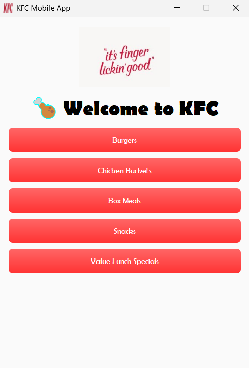
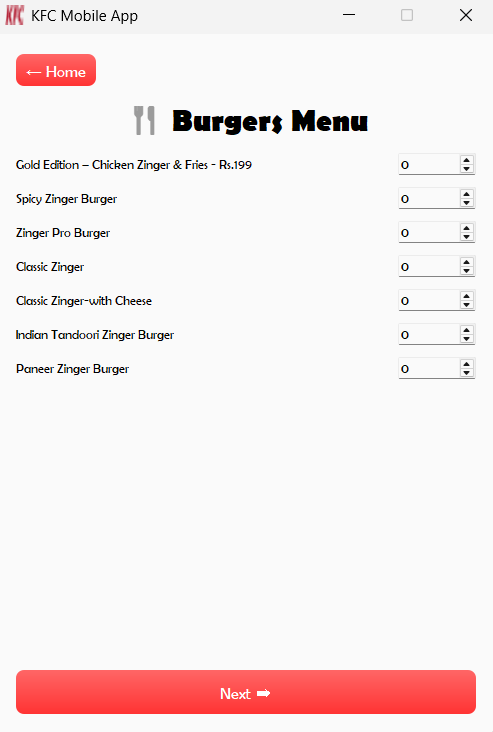
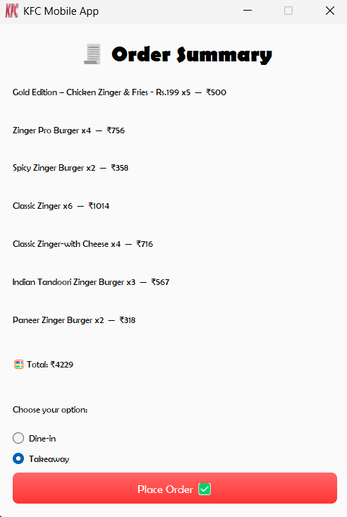

🍗 **KFC Ordering App using Pyqt5**

A clean, responsive PyQt5 application that replicates the feel of a mobile food ordering system—designed for restaurant use, with category-based navigation, item selection, and order summary confirmation.

---

🚀 **Features**

- 📱 Mobile-style page transitions (Home → Menu → Summary)
- 🖼️ Branded home screen with logo and category buttons
- 🍔 Dynamic menu page with item-specific quantity selection
- 🔢 Live tracking of chosen items via QSpinBox
- 🧾 Summary screen with pricing, total cost, and order mode
- ✅ “Place Order” button with confirmation popup

---

🔧 **Tech Stack**

- **Python 3.x**
- **PyQt5** for GUI development
- Qt Style Sheets for UI styling

---

## 📸 **Screenshots**

### 🏠 Home Page



### 🍔 Menu Page



### 🧾 Summary Page



📁 **How to Run**

Clone the repository:
   ```bash
   git clone https://github.com/Akasshh02/KFC-Ordering-App-using-Pyqt5.git
   ```
**About Me**

**Akash
Python Developer aspiring to Cloud Engineer
I love combining clean UI with functional design to build professional-grade applications.**
Connect with me:
www.linkedin.com/in/akash-p-3639742b3
